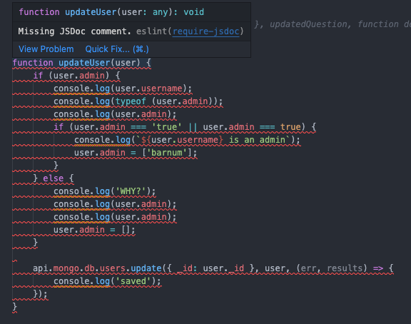

## The Importance of Coding Standards in Learning a New Language

I believe that coding standards play a crucial role in learning a new programming language because they help me develop good coding skills while at the same time eliminating the bad ones. With the help of coding standards, I can write more structured and readable code. 

Tools like ESLint help me enhance my code by making sure I follow all of the coding standards. 

## Code Readability and Team Collaboration

One of the biggest advantages of coding standards is that it improves code readability. Continuing to write clean and consistent code is an important skill, especially when I work in teams. 

Readable code makes it easier for other programmers to understand my logic, debug issues, and collaborate more effectively. By having everyone on my team follow the same coding standards, my coding projects can be more organized and it makes it easier to maintain. 

## My Experience Using ESLint

After my first week of using ESLint with VSCode, I’ve found it to be an amazing tool for my programming assignments. It helps me detect errors in my Javascript and Typescript code, which allows me to easily fix the errors as I code. 

So far, ESLint has reduced the time that I spend debugging my code by pointing out errors like syntax errors, formatting issues, and logic mistakes.

## Debugging and Fixing ESLint Errors

One aspect that I enjoy about using ESLint is that fixing errors isn’t too difficult. The error messages are clear and provide excellent explanations of what went wrong. Another awesome thing is that ESLint also gives me suggestions on how to go about fixing the error, which makes the debugging process more efficient. 

However, if I ever struggle to resolve an error, I utilize GitHub Copilot as an additional resource to help me debug my code. 

## Long term Benefits of Using ESLint

Overall, integrating ESLint into my programming skill set has been a game changer. It not only helped me write better code, but it also helped me progress my understanding of Javascript and Typescript. 

I also feel more confident in my ability to produce clean, efficient, and error free code.

## AI Use

I used AI to help me with my grammar, main title, and subtitles for my essay.
