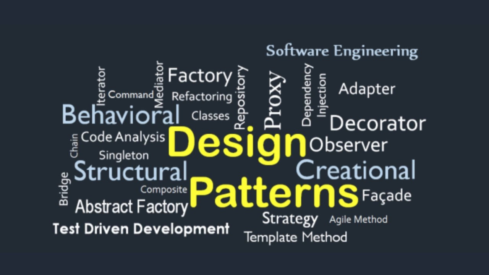

## Recipes in the Kitchen and in Code

Picture yourself in a busy kitchen. You're asked to make spaghetti, but you don't have a recipe to follow. You're trying your best to make the spaghetti based on your own knowledge, but you overcook the pasta and forget to salt the sauce. The meal ends up edible, but not the best. The next person who tries to cook the same dish will most likely have a different approach on how to recreate the dish, as well as make different mistakes.

In software development, this kind of problem always happens. Developers face problems that other before them have already solved, but without shared guidance as to how to solve that problem, everyone ends up reinventing the wheel.

Design pattern are the solution. They are the recipes for common problems in coding. Instead of fumbling through every new dish, you can follow the steps that others have tested and perfected. You can get clean and maintainable code. Design patterns help teams speak the same language, avoid issues, and help you write code more efficiently.

## One Chef per Station: The Singleton Pattern

In a real kitchen, having two chefs fighting over the same pan or burner is a recipe for disaster. If they both try to salt the soup or stir the sauce, a lot of wrong things could go wrong.

In software engineering, this happens a lot. With previous projects, I've had to build a login system for a web application that needed to connect to a database. At first, every part of my code had its own connection, which overloaded the system and caused bugs in the code. The solution to this was the Singleton pattern.

Singleton patterns makes sure that only one instance of a class exists. Like assigning one check to the pasta station, I used it to assign one database connection for the entire app. Everyone shared that one connection, which helped keep things efficient.

Using the Singleton pattern also made my code easier to manage and helped avoid the chaos of having multiple conflicting access points.

## Ordering a Dish: The Factory Pattern

The Factory Pattern in software engineering is similar to ordering food at a restaurant. As a customer, you don't worry about the ingredients or the cooking process, you just tell the waiter what dish you want, and the kitchen takes care of the rest. In the same way, when using the Factory Pattern in code, you don't create objects. You have the factory class create an object for you based on some input, like a type or name. 

For example, if you request a "Pizza," the factory will return a Pizza object. This approach hides the complex logic from the client and makes your code easier to manage and extend. If you want to introduce a new dish like a taco, you only need to update the factory, without changing the code. This leads to a better version of your code, and supports the open-closed principle in object-oriented design. This means that your code is open for extension, but closed for modification. Overall, the Factory Pattern helps you build flexible and scalable applications by allowing there to be object creation in one place.

## Why do patterns matter?

Design patterns don't just solve technical problems, but they help people work together better. Patterns keep projects in it's top shape because code that is built with patterns makes it easier to read, test, and change. You can think of this as a restaurant because it will run much smoother when everyone follows the same recipes. Generally, software engineers will thrive when they use shared patterns. For example, you wouldn't build a skyscraper without blueprints and good software isn't about writing code, it's mainly about using patterns that provide structure and clarity.

## AI Use

I used AI to fix my grammar, titles, subtitles, and to look for a metaphor to relate to design patterns.
