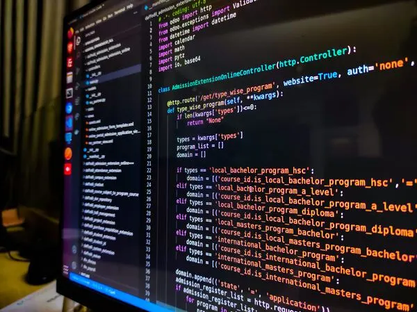

## Learning to think like a Software Engineer

As I wrap my semester up with ICS 314, I've come to learn that software engineering goes far beyond writing code for web appplications. Taking this course has introduced me to engineering principles that are applicable with many different fields in software development. In my opinion, the most impactful topics to me were Coding Standards and Configuration Management. Prior to this class, I always thought that coding standards was mainly about making your code functionable, as well as have documentation as to how your code works. As for configuration management, I thought that it was about keeping your code organized at all times and making sure the program runs properly.

## Coding Standards: Building Readable and Reliable Code

When I first started coding for the first time back in ICS 111, I always liked the idea of organizing my code and making sure my code runs correctly. As I dove deeper into what software engineering was really about, I found out that coding standards are a set of guidelines and practices that developers follow when writing code. These guidelines would consiss of naming conventions, formatting rules, commenting styles, and structural patterns. The purpose of coding standards are to make the code more readable, consistent, and maintainable. 

This is usually helpful when it comes to working in team environments. This definitely helped me this semester, since I had the opportunity to work with a team to create a final project. Everyone in my group needed to follow specific coding standards, so that each person in the group would be able to have a clear understanding of what's going on. With coding standards, it's not just about aesthetics, but it works well in team collaboration, fewer errors, as well as a smoother coding experience for everyone.

## Configuration Management: Ensuring Stability Across Changing Environments

Prior to learning about software engineering, hearing about configuration management made me think of organizing code and making sure that the code was well documented. In reality, configuration management is about tracking and controlling changes in software systems. During the final group project, every person in my group had the opportunity to practice this, since there was going to be a lot of changes that would be happening to several parts of our code.

Being that said, we all had to stay as organized as possible to prevent any errors. Some of the things we had to make sure was that everyone was using the same version of the software, allowing others to reproduce our project, tracking changes, as well as the tools that we utilized. Having all of these are crucial in making sure that everything runs as smoothly as possible.

## Conclusion

To conclude, ICS 314 has taught me a lot about software engineering. I've learned that it's more than just writing code that works, but it's about writing code that works well in a way where others can reproduce them and use it. With topics like coding standards and configuration management, I now understand the importance of structure, consistency, and collaboration in software projects. Even though, I only choose these two concepts, I will take all of the concepts that I've learned in software engineering and apply it in the future.

