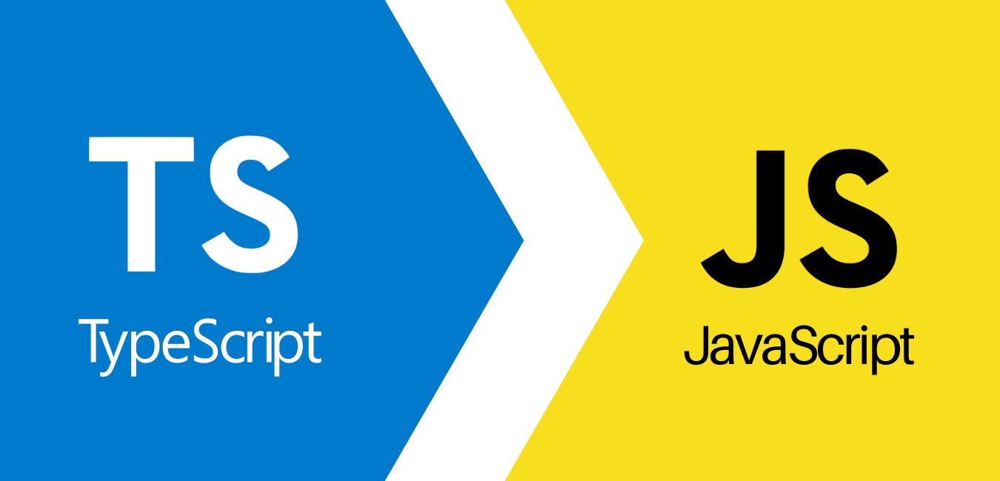

## Discovering the World of TypeScript

As of right now, I find TypeScript both fun and interesting to learn. I have some experience using JavaScript from my previous programming classes. However, I’ve never worked with TypeScript before, so this is my first time exploring it. TypeScript shares many similarities with JavaScript, which makes it slightly easier for me to understand. Before taking this class, I’ve learned several programming languages, including JavaScript, C, C++, and a little bit of Python. 

Since TypeScript uses the same syntax as JavaScript, picking it up hasn’t been too difficult. However, I still need to practice TypeScript more to fully grasp it, as there are new concepts I’m still working to understand. When it comes to athletic software engineering, it's always beneficial to consistently practice your coding skills. 

## Athletic Software Engineering: In Class WODs

The in-class WODs are particularly useful because they help shape you into a more efficient and reliable programmer. In my opinion, the process can feel stressful because I spend a lot of time carefully reading the problem to fully understand the question. I often start to panic due to the limited time available to complete the in-class WODs. However, it becomes enjoyable once you’re able to arrive at the correct solution. This approach works for me because it encourages me to practice coding regularly and helps me become accustomed to solving problems within a limited timeframe.

## A Gateway to Better Programming

TypeScript is a great programming language because its structure is organized and easy to follow. Maintaining organization also depends on me as the programmer. By continuing to write clean, structured code, I can make debugging much easier for myself. One of the features I love about TypeScript is its ability to quickly detect bugs, which allows me to modify my code efficiently. 

I am eager to explore more of what TypeScript has to offer. Since I already have a solid foundation in JavaScript, adding TypeScript to my skill set will be incredibly valuable.

## Code, Creativity, and Growth in Software Engineering

My interests in Software Engineering include Cybersecurity, Software Development, and Troubleshooting. These areas allow me to apply my programming knowledge in meaningful and impactful ways. Cybersecurity is interesting to me because it involves protecting systems and data from potential threats, which is both challenging and rewarding. 

On the other hand, Software Development and Troubleshooting require both creativity and problem-solving skills, which I enjoy. These interests motivate me to improve my technical skills and explore new tools, such as TypeScript.

## The Future of My Programming Journey with TypeScript

Overall, learning TypeScript will be a valuable addition to my programming journey. It bridges the gap between familiar and new concepts by making it approachable yet challenging. By practicing and honing my TypeScript skills, I hope to become proficient in the language and apply it effectively to projects that align with my interests in software engineering. 

I am excited to see how TypeScript will enhance my abilities and contribute to my future career in technology.

## AI Use

I used AI to check my grammar, sentence structure, paragraph flow, paragraph titles, and the essay title. 

