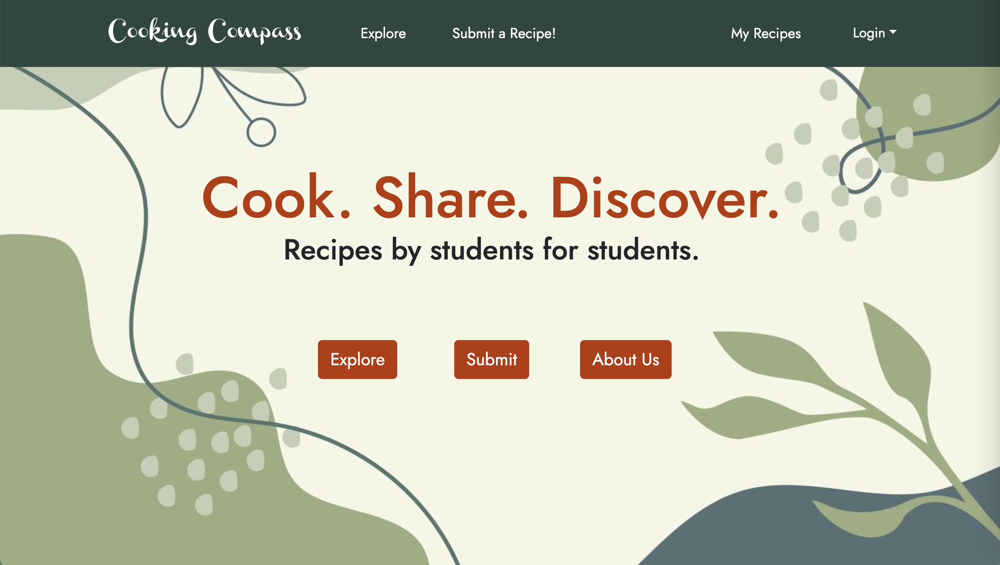

## Brief Overview

Cooking Compass is an app designed for UH Mānoa students to discover and share inventive recipes that accommodate the common constraints many college students face, such as limited kitchen resources, cooking skills, and time. By offering accessible and creative recipe ideas, this project seeks to build a community that values resourcefulness, healthy eating, and the joy of cooking.

## My Contributions

This was a group project for ICS 314 that consisted of four team members and structured around three milestones. Each milestone came with a set of required tasks that needed to be completed. To stay organized, we used a combination of GitHub Projects and to-do lists to track progress.

## Tasks that I completed

At the start of the project, I worked on both front-end and back-end development, focusing on the sign-up and submit recipe pages. For the sign-up page, I created a user-friendly interface that allowed new users to register, ensuring secure handling of their credentials. On the submit recipe page, I implemented a form to submit recipes and connected it to the database, ensuring data such as recipe names, ingredients, and steps were properly stored.

I also made sure the team followed the IDPM guidelines by creating and naming branch issues for each task, keeping us on track throughout the milestones. To improve our development process, I implemented continuous integration with GitHub Actions. I set up a workflow that automatically installs dependencies and runs tests whenever code is pushed or a pull request is made, ensuring new changes didn’t break existing functionality.

Additionally, I wrote Playwright tests for all major pages, including sign-up, report user, sign-in, explore, login, about, submit recipe, and recipe browsing pages. These tests simulate real user interactions to ensure each page functions correctly, and integrating them into CI helped us catch bugs early.

## What I learned 

Through this project, I gained experience in building and connecting front-end pages to a working back end. I followed IDPM guidelines using GitHub issues and project boards to manage tasks effectively. I also implemented continuous integration with GitHub Actions and wrote Playwright tests for key pages, which helped ensure code quality and application reliability.

## Project Homepage and Organization Page

[Project Homepage](https://cooking-compass.github.io).
[GitHub Organization Page](https://github.com/Cooking-Compass).

## AI Use

Used AI for grammar and paragraph flow.
