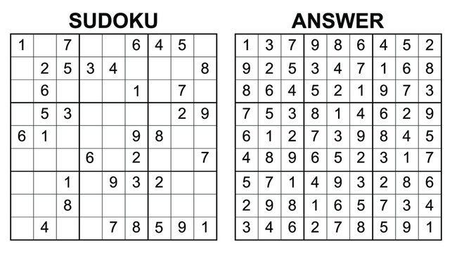

## How To Play Sudoku

A Sudoku is a 9x9 grid of integers, each with values 1..9. A Sudoku is valid when each of the 9 rows, each of the 9 columns, and each of the 9 3x3 boxes in the grid has exactly one each of the possible values 0..F, without any duplicates.
A Sudoku problem is a Sudoku grid with some of the grid cells already filled. The solution fills the remaining cells to give a valid Sudoku.

## Recursive Strategy for finding a solution to a Sudoku problem

- If all cells are filled, see if this Sudoku is valid. If it is valid, we have found a solution. If not, this Sudoku is not a solution. Base case 1

- If at least one cell is not filled, see what values are legal for this cell:

- If no values are legal, then this Sudoku is not a solution. Base case 2

- If one or more values are legal, place each legal values in the cell in turn, one at a time. For each legal value, recursively attempt to find a solution that fills the remaining empty cells.

- If a solution is found for at least one legal value, set the Sudoku to reflect this solution, and return that a solution was found.

- If no solution is found for any legal value, reset this cell to the value it had when this method was called, and report that this Sudoku does not have a solution.

- Every time the code recursively attempts to find a solution, it will fill cells in the Sudoku grid. If the attempt is not successful, returning, your code must restore the Sudoku grid to the values had before the call.


## Some code from the Sudoku class

```cpp
  /**
   * Find an assignment of values to sudoku cells that makes the sudoku valid.
   *
   * @param the sudoku to be solved
   * @return whether a solution was found if a solution was found, the sudoku is filled in with the solution if no
   * solution was found, restores the sudoku to its original value
   */
  public static boolean solveSudoku(int[][] sudoku) {
    // scan for a 0
    // loop over the rows
    for (int rows = 0; rows < sudoku.length; rows++) {
      // loop over the columns
      for (int columns = 0; columns < sudoku[rows].length; columns++) {
        // if cell is a 0
        if (sudoku[rows][columns] == 0) {
          // create a new array list to get the legal values
          ArrayList<Integer> list = legalValues(sudoku, rows, columns);
          // loop over the legal values
          for (int x = 0; x < list.size(); x++) {
            // fill the cell with the value
            sudoku[rows][columns] = list.get(x);
            //  if solveSudoku return true
            if (solveSudoku(sudoku)) {
              return true;
            }
          }
          // set the cell back to 0
          sudoku[rows][columns] = 0;
          return false;
        }
      }
    }
    return true;
  }
```

## Code Repository
[Link to source code](https://github.com/binhn-tran/sudokusolver)

[Link to sudoku](https://courses.ics.hawaii.edu/ics211s21/morea/110.recursion/experience-H09-decimal.html)
